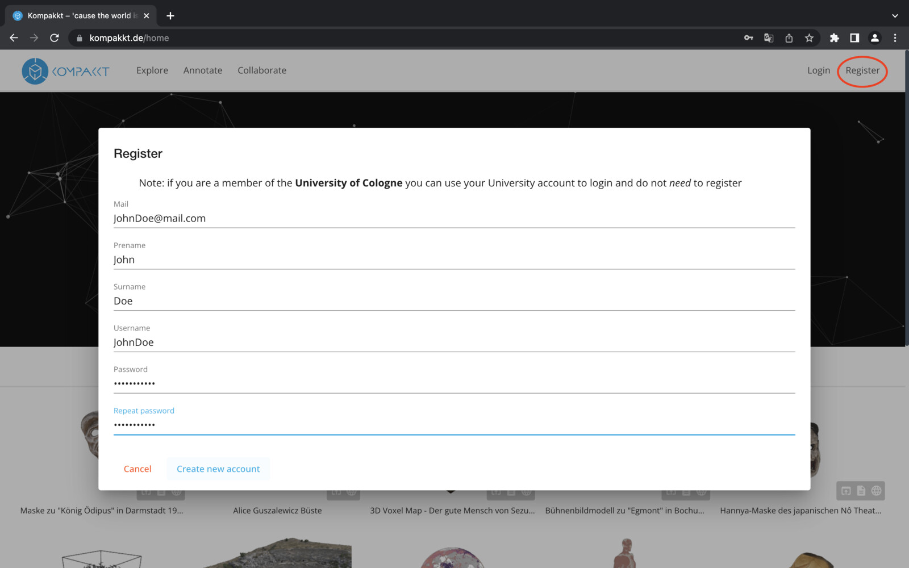
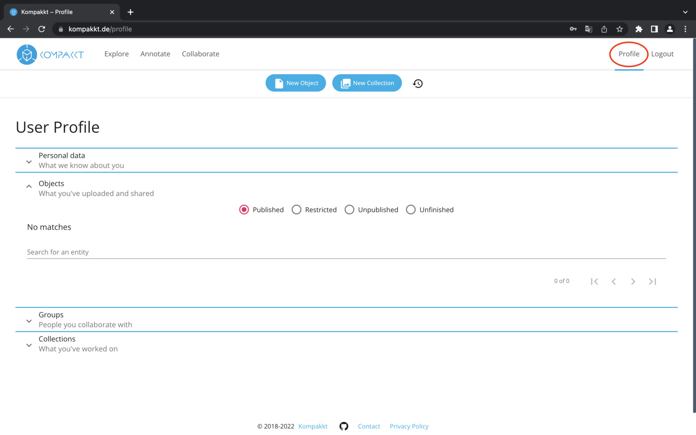

 To have full access to Kompakkt's Viewer, you need to register.

  { width="1024" }

If you are a student at the University of Cologne, you can login with your student account.

  { width="1024" }

  Your profile information is displayed here.

  { width="1024" }

  Under your profile you have access to personal information, uploaded and shared items, collaboration history with others in a group, and collections you have contributed to. In order to use Kompakkt to its full potential, it is necessary to have an account with upload capabilities. If you are a student at the University of Cologne, you can log in with your student credentials. Under their profile, they can access personal data, uploaded and shared objects, collaboration history with others in a group, and collections they have contributed to.

