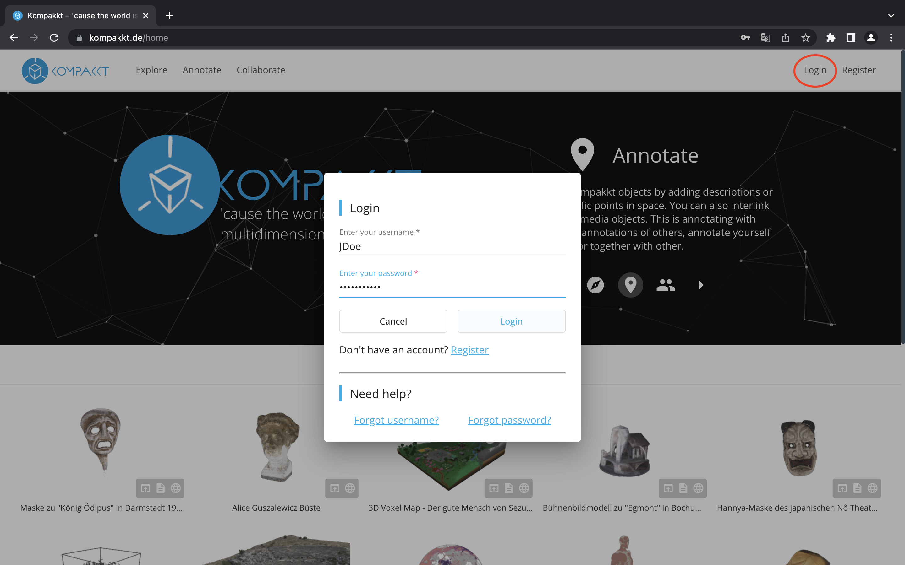
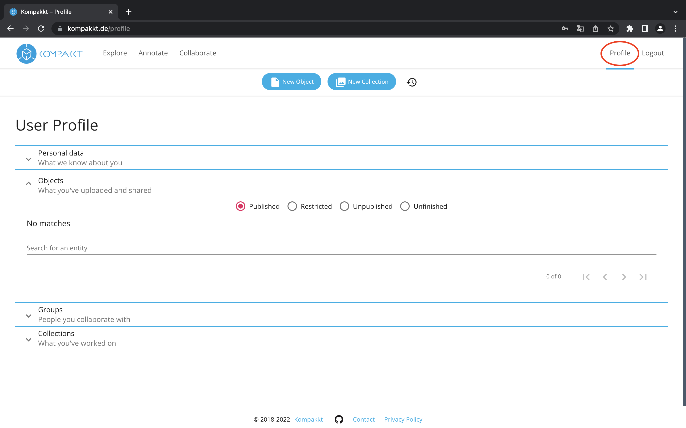

 In order to have full access to  Kompakkt's viewer, you need to register.

  { width="800" }

If you are a student of the University of Cologne, you can log in with your student credentials. 

  { width="800" }

  

  Your profile information is seen here.

 
  { width="800" }
  
  Under your profile, you can access personal data, uploaded and shared objects, collaboration history with others in a group, and collections you have contributed to. To utilize Kompakkt's full potential, having an account with upload capabilities is necessary. If one is a student at the University of Cologne, they can log in using their student credentials. Under their profile, they can access personal data, uploaded and shared objects, collaboration history with others in a group, and collections they have contributed to.
  

