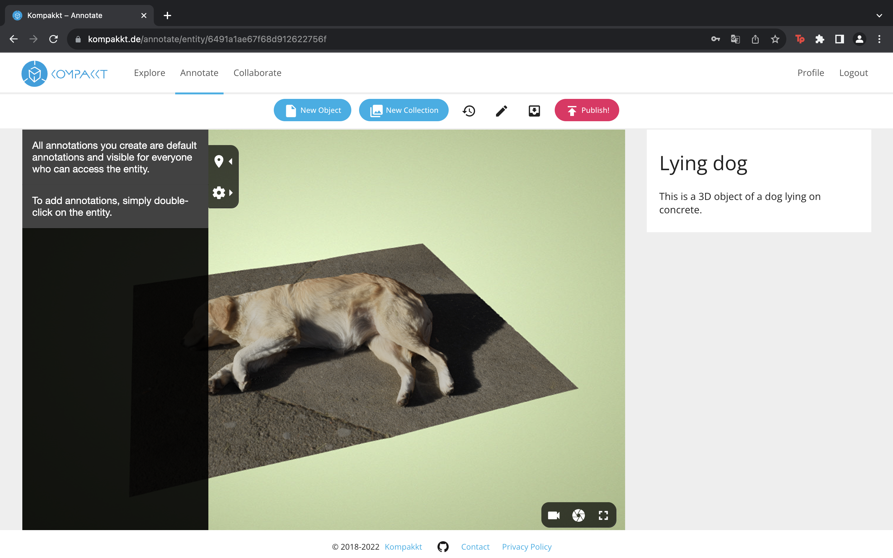
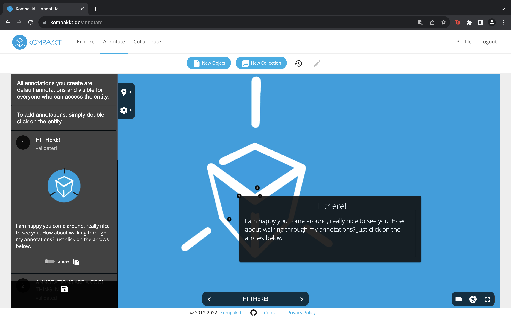

First, users need to search for the specific object they want to annotate by exploring the available options within Kompakkt, also considering the annotation access. Once they have found the object they wish to annotate, they can simply click on it. By doing so, a dedicated page opens, showcasing the object along with relevant information associated with it.

{ width="800" }

{ width="800" }

Users can also select the "Annotate" option provided on the object's page. By choosing this option, a brief description is displayed, providing users with instructions on how to proceed with the annotation.

  { width="800" }

To create an annotation, users can double-click on the object. This action triggers a prompt that appears on the screen, asking the user to enter a title and description for the annotation. Users have the flexibility to save, delete, or edit the annotation in full-screen mode, depending on their preferences and requirements.

 { width="800" }

Once the user has completed the annotation process, the title and description they provided are prominently displayed in a fixed area of the object. This allows others who view the object to easily identify and understand the annotation.

In case users want to manage their annotations, they have the option to remove the annotation window from the object itself. However, it's important to note that even after removal, all annotations remain accessible in the side panel of the viewer. This side panel provides a comprehensive overview of all annotations associated with the object, allowing users to conveniently review and access them whenever needed.

 { width="800" }

For added convenience, users can export their annotations to a JSON file if they wish to save or share them externally with others.

To further enhance the user experience, Kompakkt offers an annotation walkthrough feature. This feature guides users through the annotated areas by automatically adjusting the camera view to focus on the fixed annotated locations. This interactive tour provides users with a more immersive and comprehensive understanding of the annotations present on the object.

 { width="800" }

By following these steps and utilizing the annotation features provided by Kompakkt, users can effectively annotate their own objects and enhance the overall collaborative experience within the platform.

