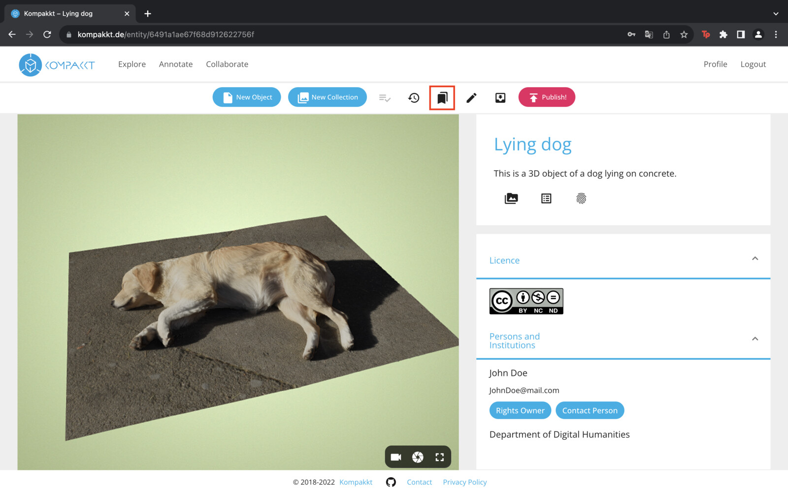
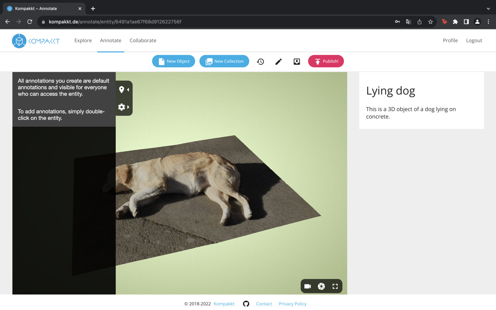
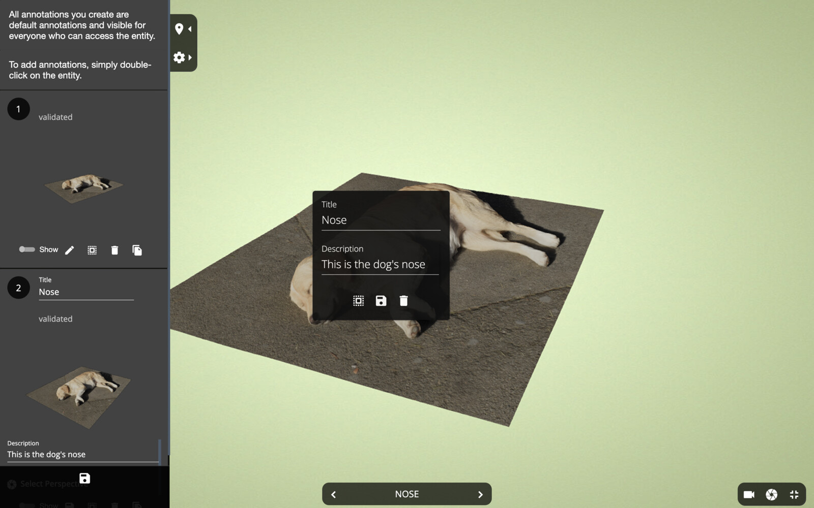
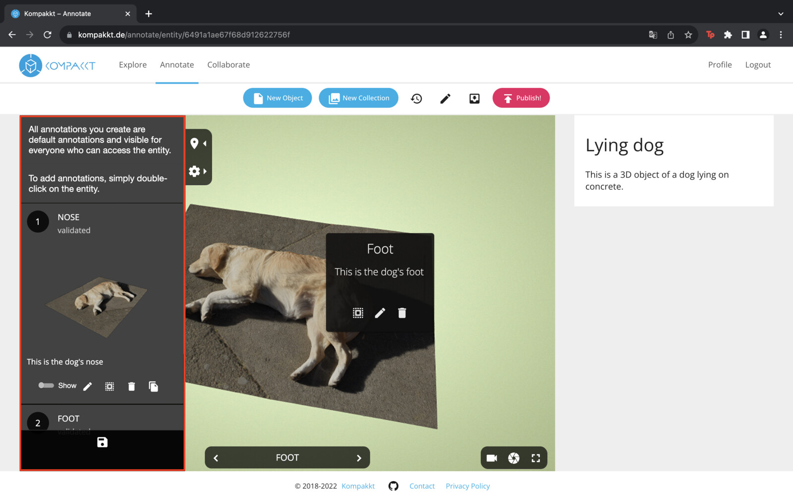
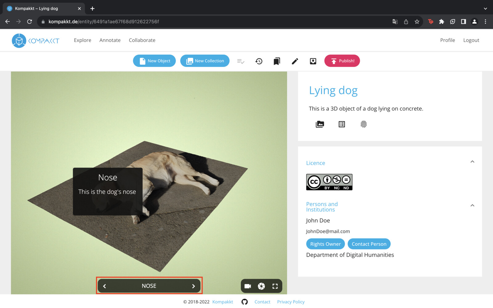

First, users need to find the specific object they want to annotate by exploring the available options within Kompakkt, including annotation access. Once they have found the object they want to annotate, they can simply click on it. This will open a special page showing the object along with the relevant information associated with it.

{ width="1024" }

{ width="1024" }

Users can also select the "Annotate" option provided on the object page. When this option is selected, a brief description is displayed, providing the user with instructions on how to proceed with the annotation.

  { width="1024" }

To create an annotation, users can double-click the object. This action triggers an on-screen prompt asking the user to enter a title and description for the annotation. Users have the flexibility to save, delete, or edit the annotation in full-screen mode, depending on their preferences and needs.

 { width="1024" }

Once the user completes the annotation process, the title and description provided by the user are prominently displayed in a fixed area of the object. This allows others viewing the object to easily identify and understand the annotation.

If users want to manage their annotations, they can remove the annotation window from the object itself. It's important to note, however, that even after removal, all annotations remain accessible in the viewer's Sidebar. This pane provides a comprehensive overview of all annotations associated with the object, allowing users to conveniently review and access them whenever needed.

 { width="1024" }

For added convenience, users can export their annotations to a JSON file if they want to save them externally or share them with others.

To further enhance the user experience, Kompakkt offers an annotation walkthrough feature. This feature guides users through the annotated areas by automatically adjusting the camera view to focus on fixed annotation locations. This interactive tour provides users with a more immersive and comprehensive understanding of the annotations present on the object.

 { width="1024" }

By following these steps and using the annotation features provided by Kompakkt, users can effectively annotate their own objects and improve the overall collaborative experience within the platform.

