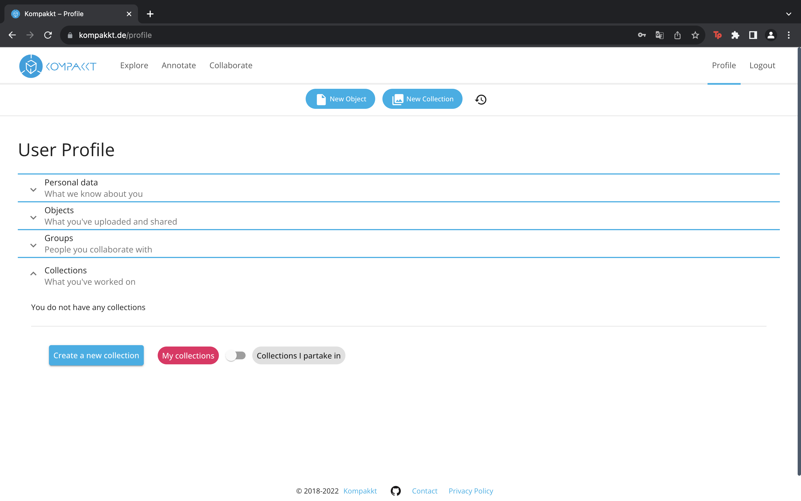
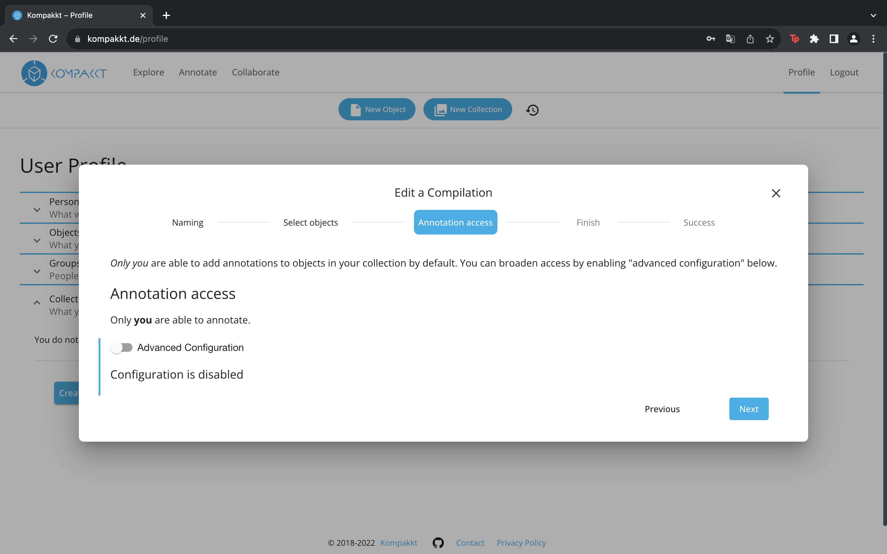
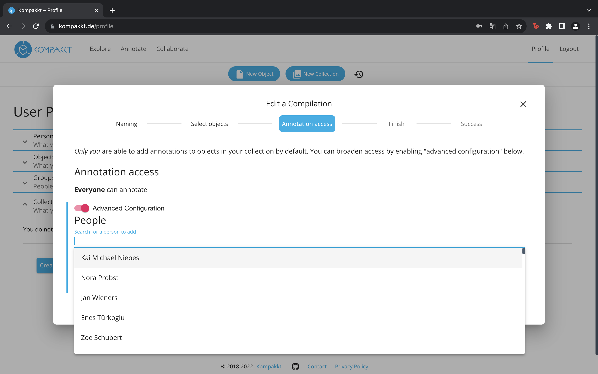
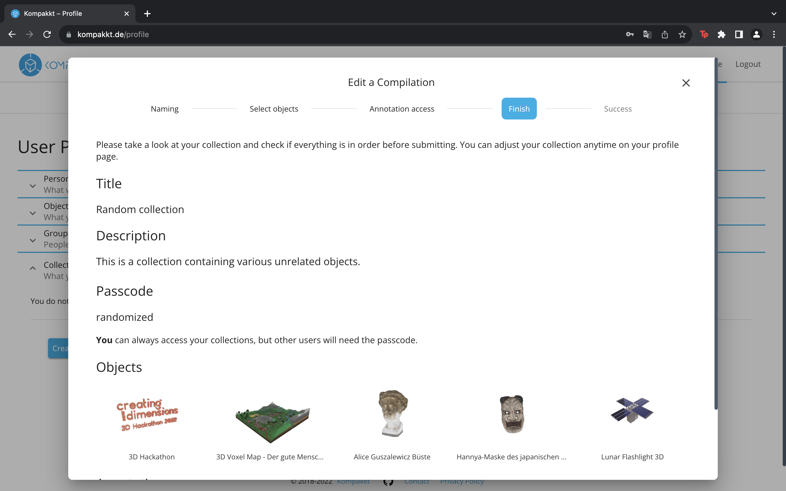
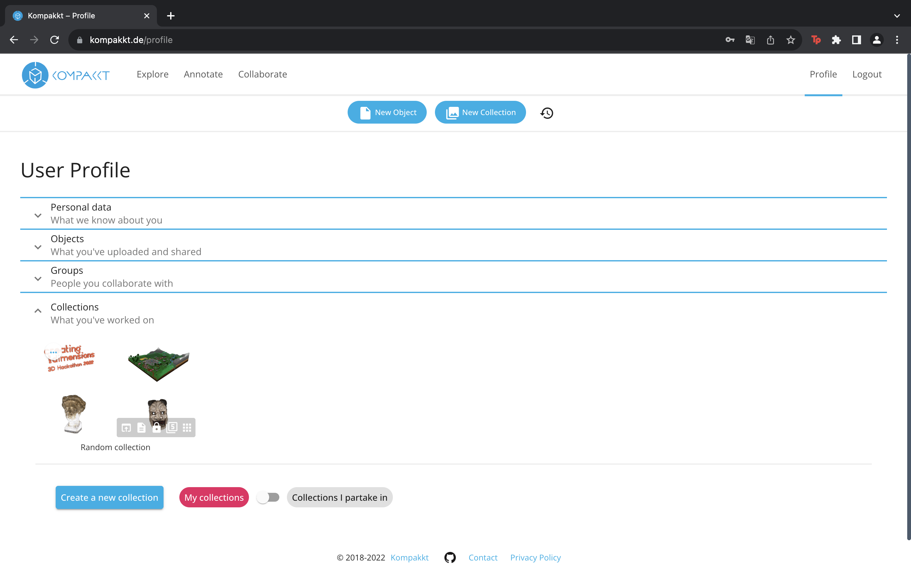

Once established, objects can be added to the collection. Moreover, users can determine the accessibility of creating annotations, allowing the addition of individuals and groups. After completing these steps, an overview of the chosen preferences is displayed and can be submitted to the profile.

{ width="800" }

Users have the option to create a new collection by providing a title, description, and an optional passcode.

{ width="800" }

Objects can be dragged into the collection.

{ width="800" }

Moreover, users can determine the accessibility of creating annotations, allowing the addition of individuals and groups.

{ width="800" }
{ width="800" }

After these steps, the collection can be saved.
{ width="800" }
{ width="800" }

