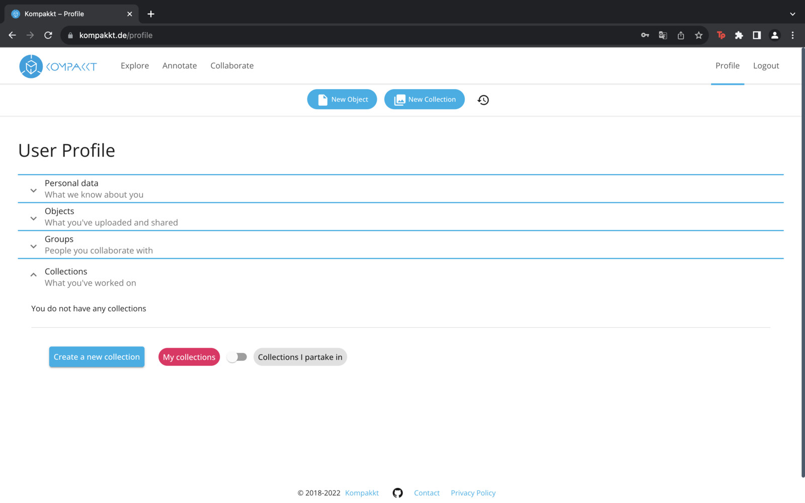
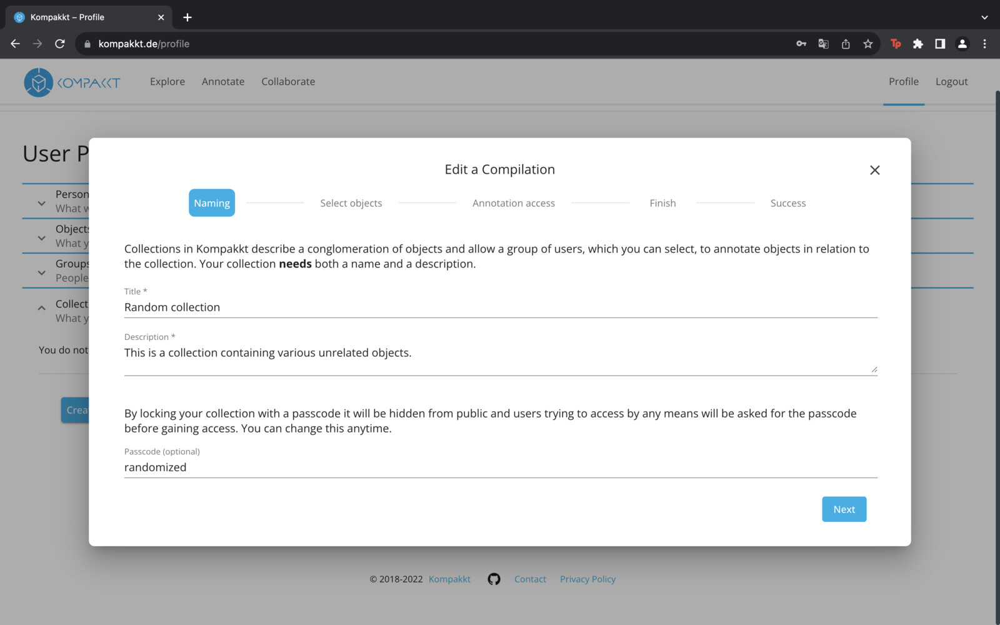
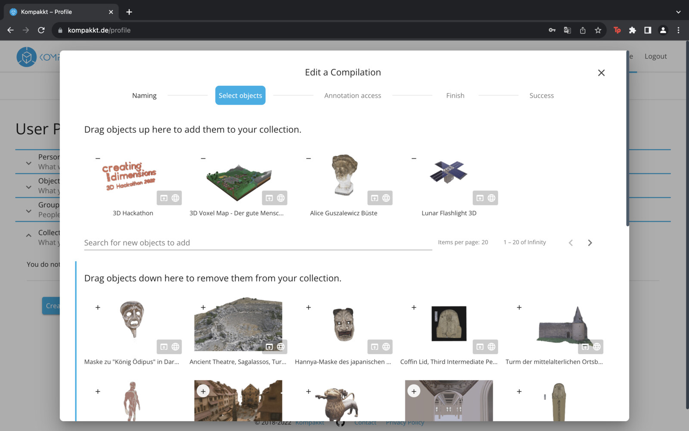
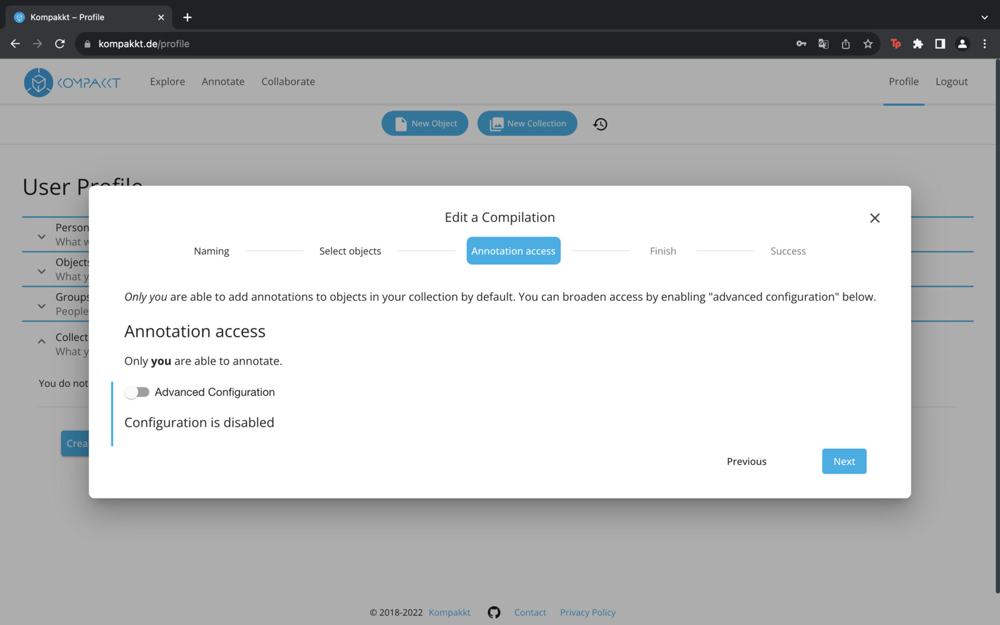
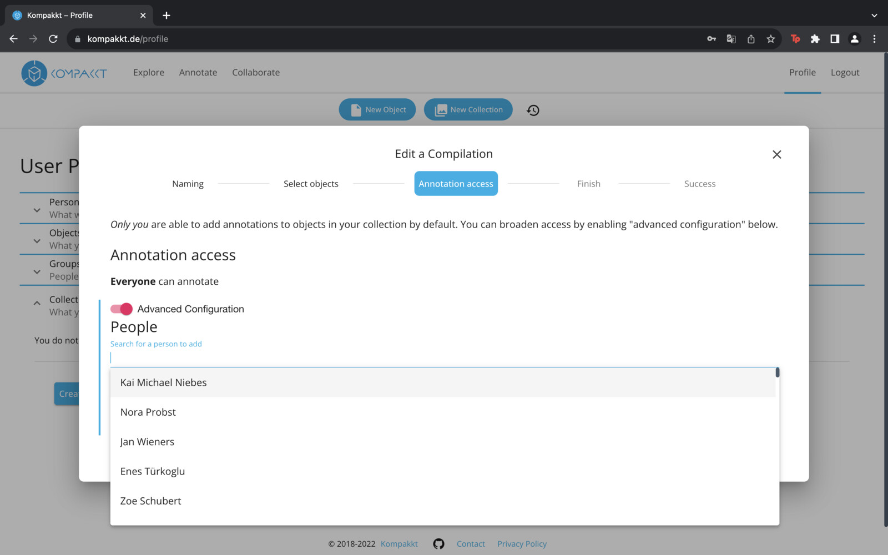

Once created, items can be added to the collection. In addition, users can set the accessibility of annotation creation, allowing individuals and groups to be added. After completing these steps, a summary of the selected preferences is displayed and can be saved to the profile.

{ width="1024" }

Users have the option to create a new collection by entering a title, description and an optional passcode.

{ width="1024" }

Items can be dragged into the collection.

{ width="1024" }

Users can also control the accessibility of annotation creation, allowing the addition of individuals and groups.

{ width="1024" }
{ width="1024" }

After these steps you can save the collection.
{ width="1024" }
{ width="1024" }

