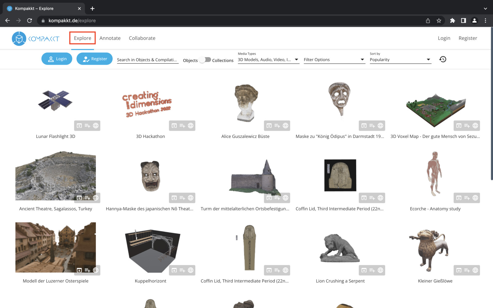
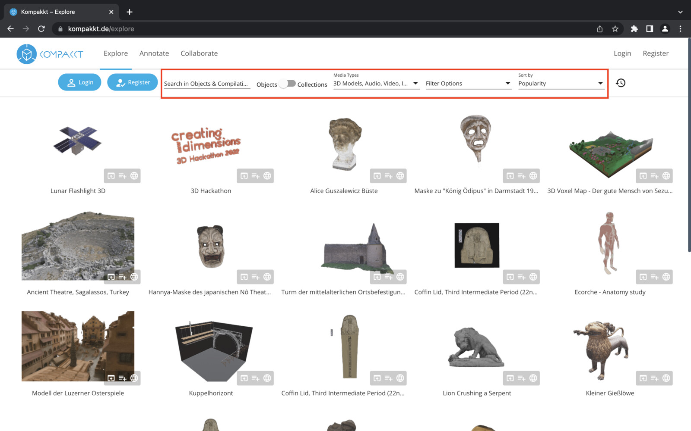

The Explore page includes all published items in Kompakkt. These filters include media type, annotation capability, annotation status, restrictions, and associations.

{ width="1024" }

If someone is looking for a specific item or collection, they can search by name, using a variety of filters. Additionally, users can sort the results based on usage.

{ width="1024" }
