In order to upload objects, one needs to request upload capabilities. 

  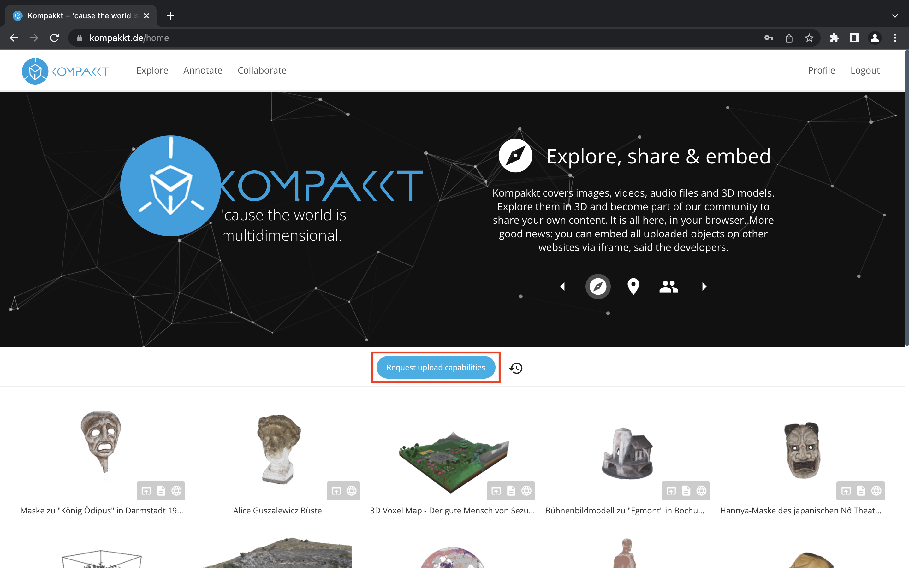{ width="800" }

Once the request has been approved, a new object or collection can be added. 

  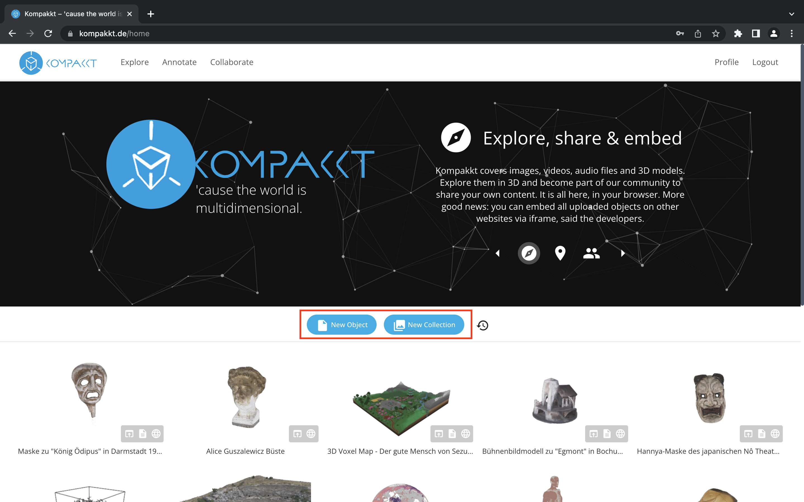{ width="800" }

  Through the process of uploading an object, there will be an instruction on what formats should be used. The object could be either a 3D model or an image, video or audio. Once the upload process has been finished, the next step is to do the setting of the object. Furthermore, one has to adjust the setting by choosing the color, width and more. 

  To upload an object or collection in Kompakkt, there are multiple formats available to choose from. These formats include 3D models (.glb, .babylon, .gltf, .obj, .stl), images (.jpg, .png, .tga, .gif, .bmp), audios (.mp3, .wav, .ogg, .m4a), and videos (.mp4, .webm, .ogv). 

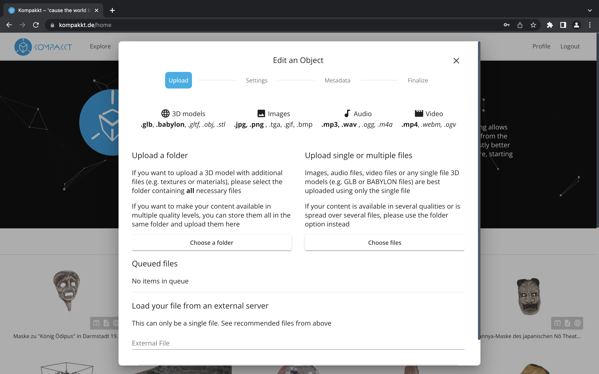{ width="800" }

Users have the flexibility to upload either a folder, a single file, or multiple files. Additionally, files can be uploaded from an external server. Once selected, the chosen files will be queued for uploading. 

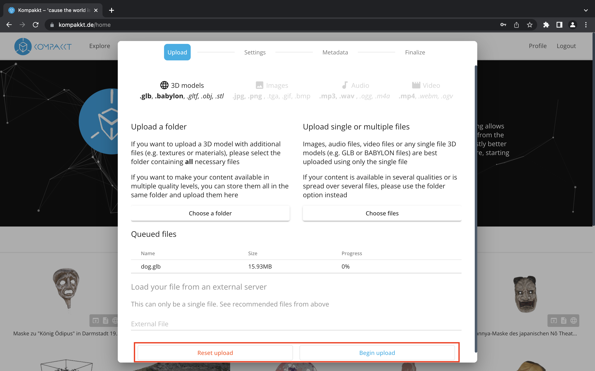{ width="800" }

The next step involves configuring the settings.

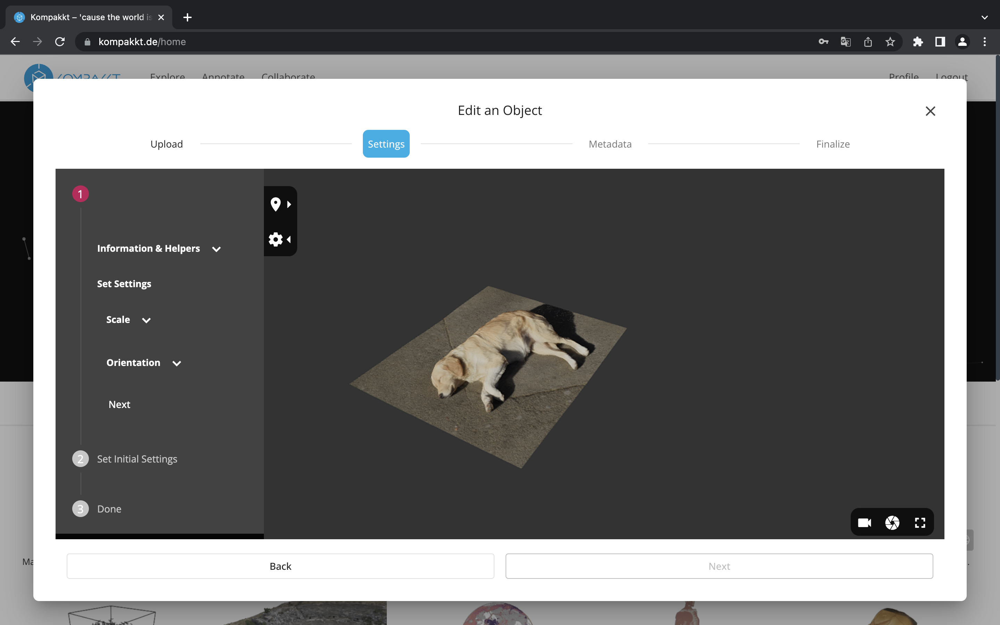{ width="800" }

Within the information and helpers section, choices can be made regarding the bounding box entity and meshes, as well as the world and local axis (with adjustable axis sizes) and grounding preferences. 

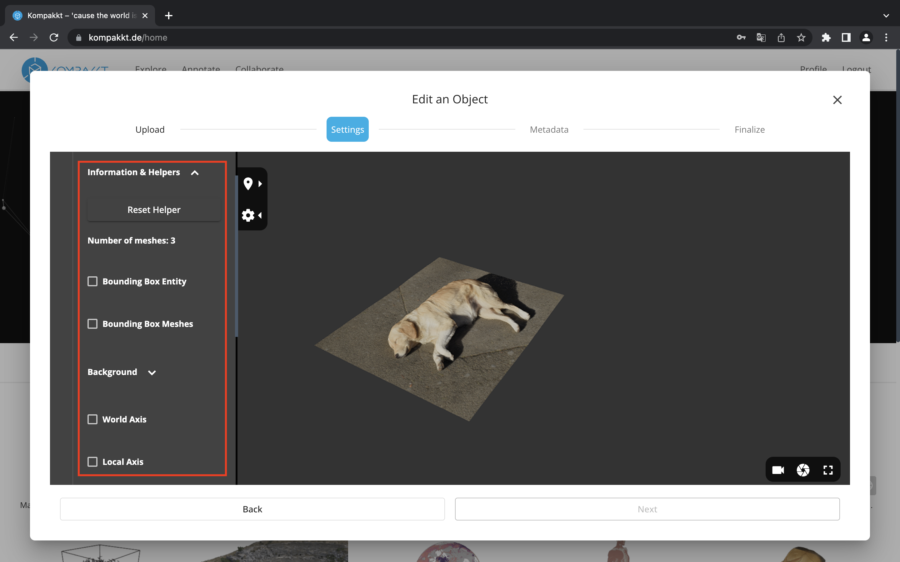{ width="800" }

The object can be scaled and oriented to a specific rotation.

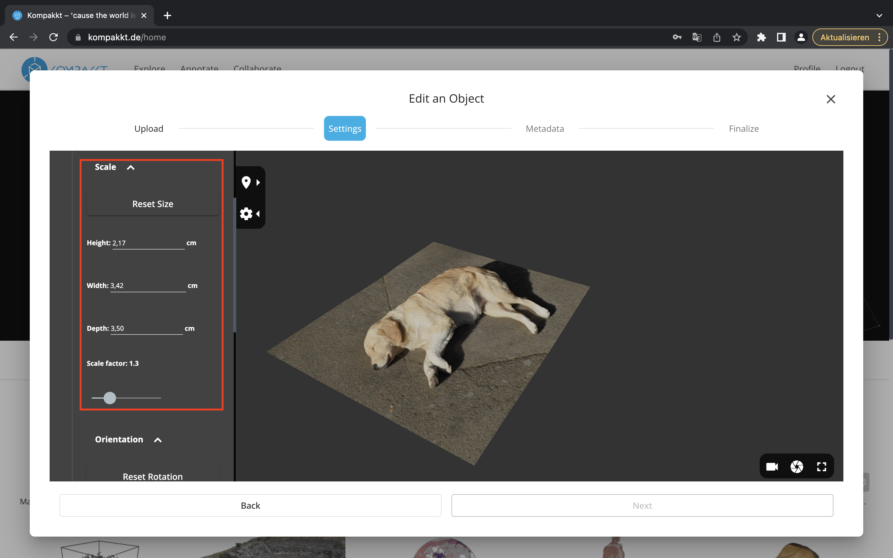{ width="800" }

{ width="800" }

Furthermore, users can select a background color and specify lighting settings.

{ width="800" }

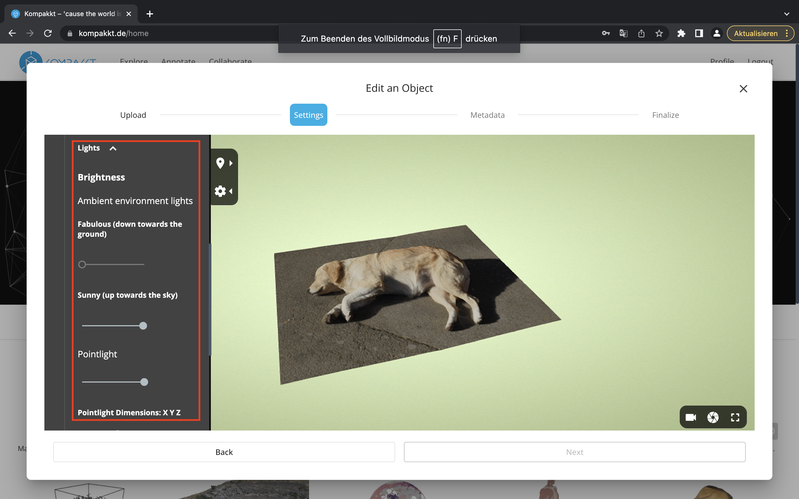{ width="800" }

An initial camera preview has to be set.

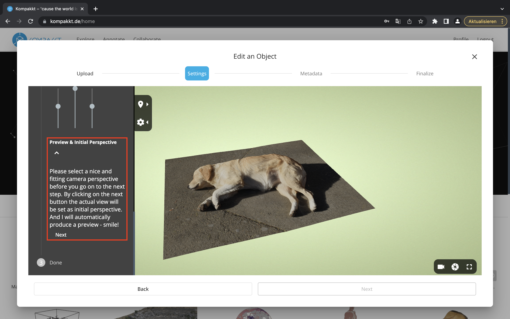{ width="800" }

Once the settings are defined, they need to be saved.

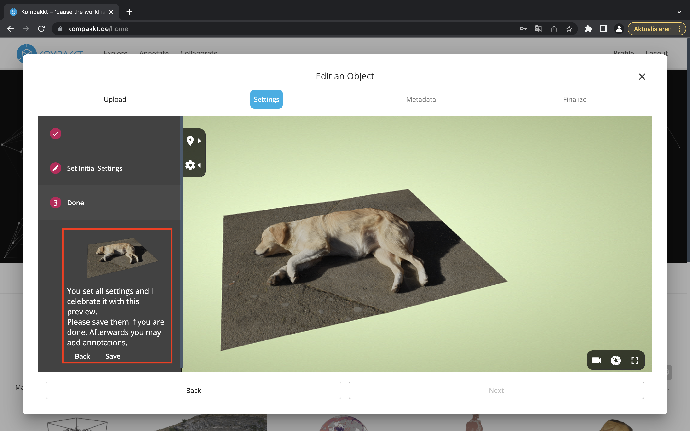{ width="800" }

Moving on to filling in the metadata, various options are available. 

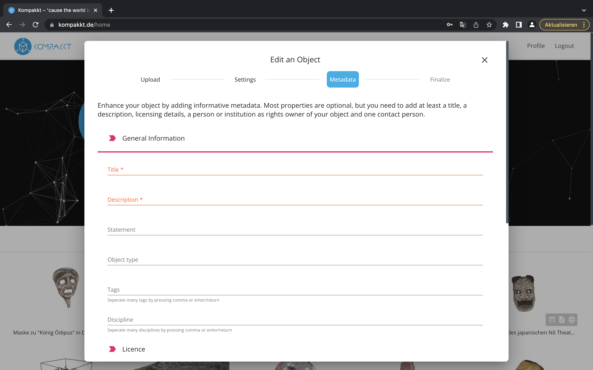{ width="800" }

it's important to complete the mandatory fields indicated in pink. Most properties are optional, but at minimum, a title, description, licensing details, rights owner information (person or institution), and one contact person must be provided. 

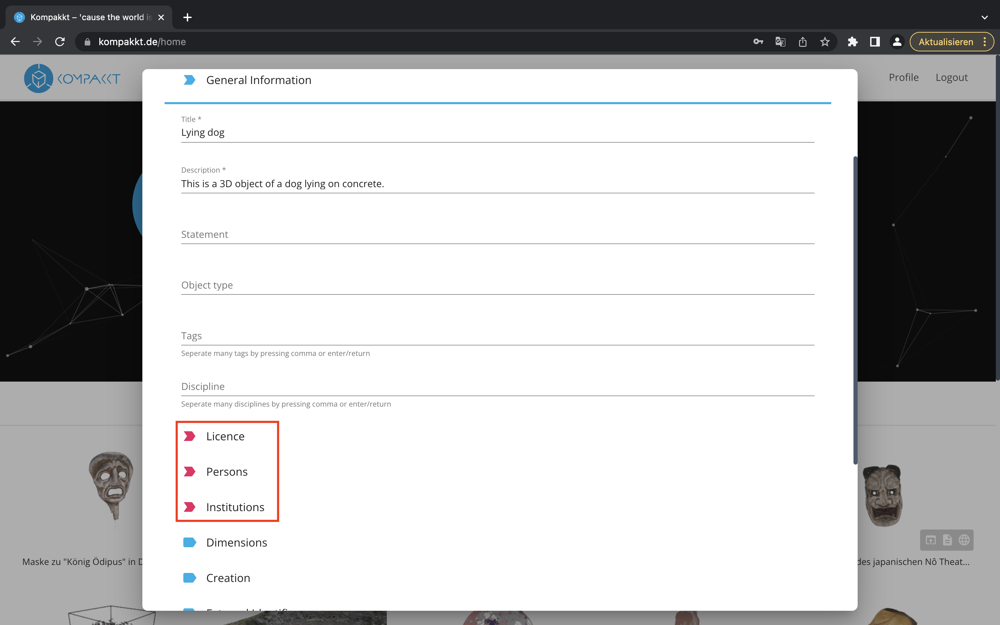{ width="800" }

After filling in the metadata, a preview of the object will be displayed in the viewer. 
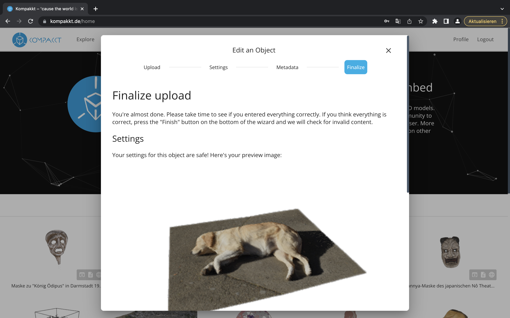{ width="800" }
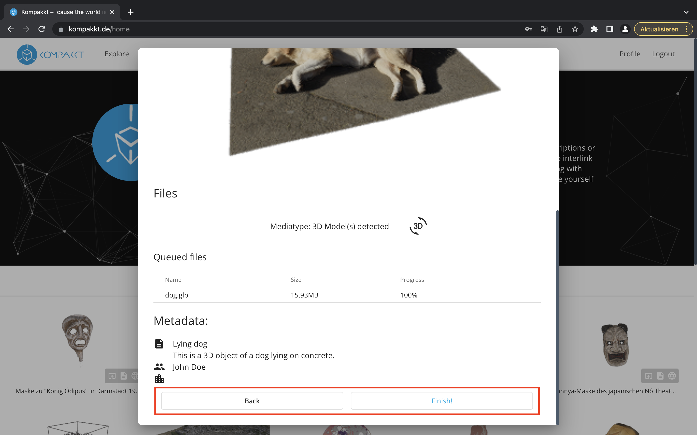{ width="800" }

Users can then choose to publish it using the publish button or keep it in the unpublished section under their profile.

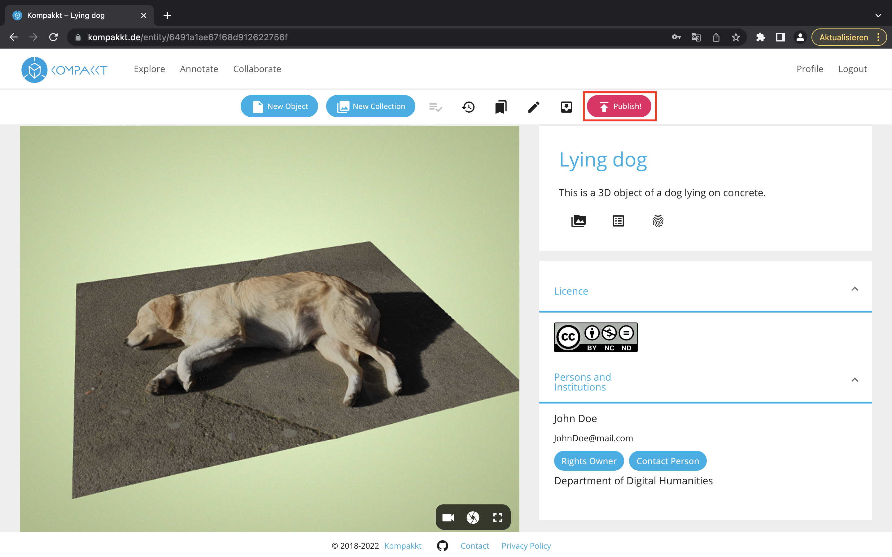{ width="800" }

