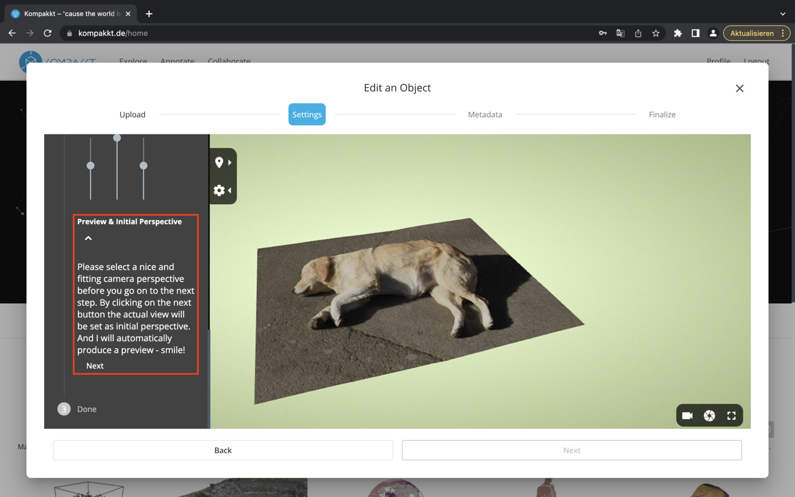

To upload items, you must request upload capabilities.

  { width="1024" }

Once the request is approved, a new object or collection can be added.

  { width="1024" }

  Throughout the process of uploading an object, there will be instructions on what formats should be used. The object can be either a 3D model or an image, video or audio. Once the upload process is finished, the next step is to adjust the setting of the object. You will also need to adjust the setting by choosing the color, width and more.

  To upload an object or collection to Kompakkt, there are several formats to choose from. These formats include 3D models (.glb, .babylon, .gltf, .obj, .stl), images (.jpg, .jpg, .tga, .gif, .bmp), audio (.mp3, .wav, .ogg, .m4a) and video (.mp4, .webm, .ogv).

{ width="1024" }

Users have the flexibility to upload either a folder, a single file, or multiple files. Files can also be uploaded from an external server. Once selected, the selected files will be queued for upload.

{ width="1024" }

The next step is to configure the settings.

{ width="1024" }

In the Information and Help section, you can select the bounding box entity and meshes, as well as the world and local axes (with adjustable axis sizes) and grounding preferences.

{ width="1024" }

The object can be scaled and rotated.

{ width="1024" }

{ width="1024" }

In addition, users can choose a background color and specify lighting settings.

{ width="1024" }

{ width="1024" }

A first camera preview must be set.

{ width="1024" }

Once the settings are set, they need to be saved.

{ width="1024" }

To fill in the meta data, there are several options available.

{ width="1024" }

It's important to fill in the mandatory fields marked in pink. Most properties are optional, but at a minimum, a title, description, licensing details, rights holder information (person or institution), and a contact person must be provided.

{ width="1024" }

After filling in the metadata, a preview of the object will be displayed in the viewer.
{ width="1024" }
{ width="1024" }

Users can then choose to publish it using the publish button or keep it in the unpublished section of their profile.

{ width="1024" }

